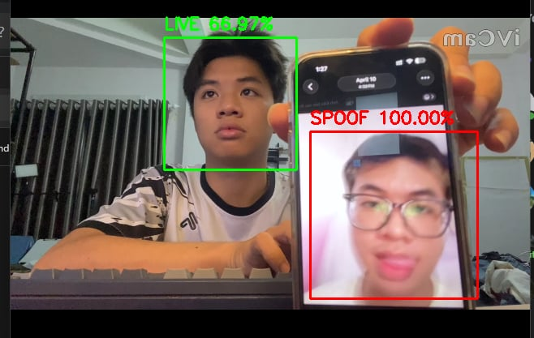
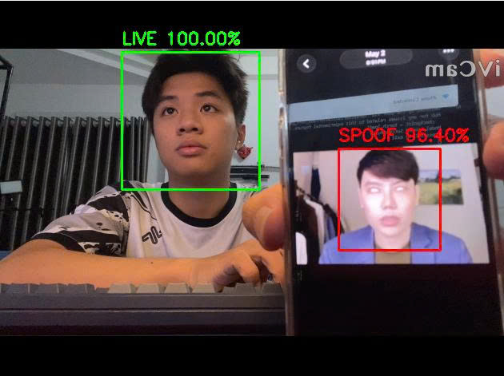
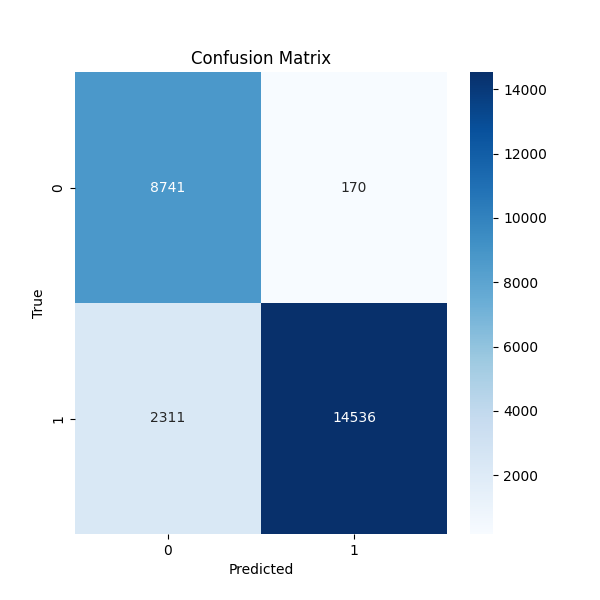
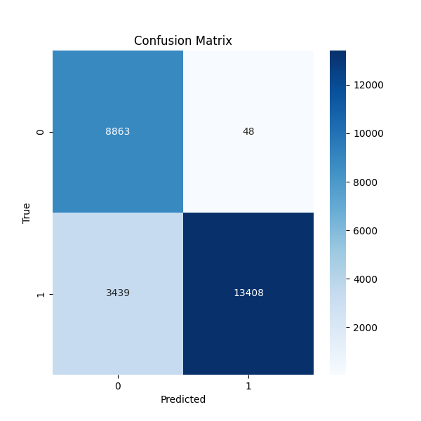
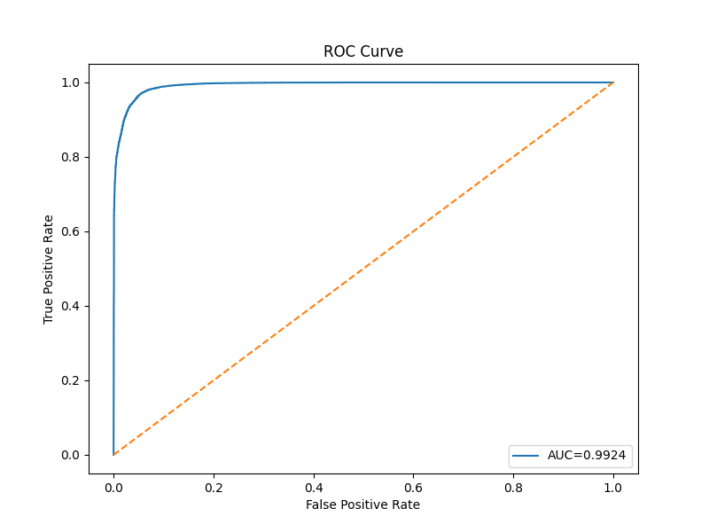

<div align="center">

# 🛡️ FSFM-Lite

### Face Anti-Spoofing with Foundation Model — Lite

**A face liveness detection system built on DINOv2 and a novel Three Consistencies (ThreeC) module.**  
Trained on CelebA-Spoof · **90.4% Accuracy** · **AUC 0.9897** · Real-time webcam demo


</div>

---

## 🎬 Demo

Real-time detection using a webcam. The model simultaneously identifies multiple faces and classifies each as **LIVE** (green) or **SPOOF** (red) with a confidence score.

| Scene 1 | Scene 2 |
|:-------:|:-------:|
|  |  |
| Person on left: **LIVE 66.97%** · Phone photo: **SPOOF 100%** | Person on left: **LIVE 100%** · Phone photo: **SPOOF 96.40%** |

> The model correctly distinguishes a real face from a photo displayed on a phone screen — even when both appear in the same frame simultaneously.

---

## 📋 Table of Contents

- [Overview](#-overview)
- [Architecture](#-architecture)
- [Results](#-results)
- [Project Structure](#-project-structure)
- [Installation](#-installation)
- [Dataset](#-dataset)
- [Usage](#-usage)
- [Real-Time Webcam Demo](#-real-time-webcam-demo)
- [Model Details](#-model-details)
- [References](#-references)

---

## 🔍 Overview

**FSFM-Lite** (Face Spoofing detection with Foundation Model — Lite) is a face anti-spoofing system that determines whether a face presented to a camera is a **real (live)** person or a **spoofing attack** (printed photo, phone screen replay, etc.).

The system is built on two core components:

- **DINOv2 ViT-B/14** — A powerful self-supervised Vision Transformer from Meta AI, used as a frozen or fine-tunable feature extractor. It decomposes each input image into a global CLS token and 256 local patch tokens (768-dim each).
- **Three Consistencies Module (ThreeC)** — A novel module that processes patch tokens through three parallel branches analyzing different aspects of consistency in the face region, then fuses their outputs before classification.

### Key Highlights

| | |
|---|---|
| 🧠 **Backbone** | DINOv2 ViT-B/14 (pretrained, ~86M params) |
| 🔍 **Core Module** | ThreeC — Spatial + Feature + Semantic Consistency |
| 📊 **Dataset** | CelebA-Spoof (270K images, Protocol 1) |
| 🎯 **Accuracy** | **90.4%** (base) / 86.5% (fine-tuned) |
| 📈 **AUC-ROC** | **0.9897** (base) / 0.9924 (fine-tuned) |
| ⚡ **Parameters** | ~98M total |
| 🎥 **Demo** | Real-time webcam inference |

---

## 🏗️ Architecture

The full pipeline processes an input image through three sequential stages:

```
Input Image  [B, 3, 224, 224]
      │
      ▼
┌──────────────────────────────────────────┐
│          DINOv2 ViT-B/14 Backbone        │
│  12 Transformer blocks · embed_dim=768   │
│  PatchEmbed: Conv2d(3→768, kernel=14×14) │
│                                          │
│  Output:                                 │
│    CLS token    →  [B, 768]              │
│    Patch tokens →  [B, 256, 768]         │
│                    (16×16 spatial grid)  │
└──────────┬──────────────┬───────────────┘
           │              │
      CLS token     Patch tokens
      [B, 768]      [B, 256, 768]
           │              │
           └──────┬───────┘
                  ▼
┌──────────────────────────────────────────┐
│            ThreeC Module                 │
│                                          │
│  ┌─────────────────────────────────────┐ │
│  │  Branch 1: Spatial Consistency      │ │
│  │  Multi-Head Self-Attention (h=8)    │ │
│  │  patch_tokens ──attn──► [B,256,768] │ │
│  └─────────────────────┬───────────────┘ │
│  ┌──────────────────── │ ─────────────┐  │
│  │  Branch 2: Feature Consistency     │  │
│  │  MLP: 768 → 3072 → 768 + LayerNorm│  │
│  │  patch_tokens ──mlp──► [B,256,768] │  │
│  └─────────────────────┼───────────────┘ │
│  ┌──────────────────── │ ─────────────┐  │
│  │  Branch 3: Semantic Consistency    │  │
│  │  Cross-Attention: patches ↔ CLS   │  │
│  │  patch_tokens ──xattn► [B,256,768] │ │
│  └─────────────────────┼───────────────┘ │
│                         │                │
│       Fusion Block (Concat + Linear)     │
│       cat([s,f,m]) → [B,256,2304]        │
│       Linear(2304→768) + GELU + LN       │
│                         │                │
│           Enhanced tokens [B,256,768]    │
└─────────────────────────┼────────────────┘
                          │
                   Mean Pool (dim=1)
                      [B, 768]
                          │
                          ▼
┌──────────────────────────────────────────┐
│             Classifier Head              │
│  Linear(768→256) → GELU → Dropout(0.2)  │
│  → Linear(256→2)                        │
└──────────────────────────────────────────┘
                          │
                          ▼
                   Logits [B, 2]
                (Live=0 · Spoof=1)
```

### ThreeC Module — Three Consistencies

| Branch | Mechanism | Purpose |
|--------|-----------|---------|
| **Spatial Consistency** | Multi-Head Self-Attention (8 heads) on all 256 patches | Detects spatial inconsistencies — real faces have coherent texture patterns across regions |
| **Feature Consistency** | Feed-Forward MLP per patch (768 → 3072 → 768) | Independently refines each patch's feature representation |
| **Semantic Consistency** | Cross-Attention: patches attend to the CLS token | Grounds local patches to global semantics — spoofed images often have local patches that are semantically inconsistent with the global face |
| **Fusion Block** | Concat(s, f, m) → Linear(2304→768) | Merges all three perspectives into a unified enriched representation |

---

## 📊 Results

Evaluated on CelebA-Spoof test set (25,758 samples, Protocol 1).

### Model Comparison

| Metric | Base Model | Fine-tuned Model |
|--------|:----------:|:----------------:|
| **Accuracy** | **90.37%** | 86.46% |
| **Precision** | 98.84% | **99.64%** |
| **Recall** | 86.28% | 79.59% |
| **F1-Score** | **92.14%** | 88.49% |
| **AUC-ROC** | 0.9897 | **0.9924** |

> **Note:** The fine-tuned model trades off accuracy for near-perfect precision (99.64%) — almost zero false positives, making it ideal for high-security applications where falsely accepting a spoof is unacceptable.

### Per-Class Classification Report (Base Model)

```
              precision    recall  f1-score   support

        Live       0.79      0.98      0.88      8,911
       Spoof       0.99      0.86      0.92     16,847

    accuracy                           0.90     25,758
   macro avg       0.89      0.92      0.90     25,758
weighted avg       0.92      0.90      0.91     25,758
```

### Confusion Matrix

| Base Model | Fine-tuned Model |
|:----------:|:----------------:|
|  |  |

### ROC Curve

| Base Model (AUC = 0.9897) | Fine-tuned Model (AUC = 0.9924) |
|:-------------------------:|:--------------------------------:|
|  |  |

---

## 📁 Project Structure

```
FSFM_Lite_Project/
│
├── README.md
├── .gitignore
│
├── src/                                    # Source code
│   ├── main.py                             # 🎥 Real-time webcam demo
│   ├── models/
│   │   ├── dino_backbone.py                # DINOv2 ViT-B/14 wrapper
│   │   ├── threec_module.py                # ThreeC module (core novelty)
│   │   ├── classifier_head.py              # Binary classification head
│   │   └── fsfm_lite.py                   # Full model assembly
│   ├── datasets/
│   │   └── celeba_spoof_dataset.py         # Dataset class + face cropping utils
│   ├── losses/                             # (planned)
│   └── utils/                              # (planned)
│
├── notebooks/                              # Development notebooks
│   ├── 01_dataset_preparation.ipynb        # Parse JSON → CSV metadata
│   ├── 02_face_processing.ipynb            # Face crop + Dataset class
│   ├── 03_dino_feature_extraction.ipynb    # DINOv2 feature exploration
│   ├── 04_threec_module.ipynb              # ThreeC design & testing
│   └── 05_fsfm_lite_model.ipynb            # Full model assembly & test
│
├── data/
│   └── CelebA_Spoof/                       # Dataset (git-ignored)
│       ├── Data/                           # Images: train/test → ID → live/spoof
│       └── metas/                          # JSON label files & protocols
│
├── metadata/
│   ├── train_df.csv                        # 244,274 training samples
│   ├── test_df.csv                         # 25,758 test samples
│   └── dataset_stats.json
│
├── configs/                                # (planned)
│
├── docs/
│   ├── Architecture Design Document.docx
│   └── Kế hoạch Dự Án.docx
│
└── outputs/
    ├── checkpoints/
    │   ├── best_fsfm_lite.pth              # Base trained model (~460 MB)
    │   └── best_fsfm_lite_finetuned.pth   # Fine-tuned model (~515 MB)
    ├── demo/
    │   ├── pic1.jpg                        # Demo screenshot 1
    │   └── pic2.jpg                        # Demo screenshot 2
    ├── reports/
    │   ├── metrics.json                    # Base model metrics
    │   ├── metrics_finetune.json           # Fine-tuned model metrics
    │   ├── classification_report.txt
    │   ├── classification_report_finetune.txt
    │   ├── confusion_matrix.png
    │   ├── confusion_matrix_finetune.png
    │   ├── roc_curve.png
    │   └── roc_curve_finetune.png
    ├── figures/
    └── logs/
```

---

## ⚙️ Installation

### Prerequisites

- Python 3.10+
- CUDA-compatible GPU (recommended for inference speed)

### Setup

```bash
# Clone the repository
git clone <repository-url>
cd FSFM_Lite_Project

# Create and activate virtual environment
python -m venv venv
source venv/bin/activate        # Linux / macOS
venv\Scripts\activate           # Windows

# Install PyTorch (adjust CUDA version as needed)
pip install torch torchvision --index-url https://download.pytorch.org/whl/cu118

# Install remaining dependencies
pip install opencv-python pandas numpy matplotlib seaborn Pillow tqdm pyarrow
```

### Dependencies

| Package | Version | Purpose |
|---------|---------|---------|
| `torch` | ≥ 2.0 | Deep learning framework |
| `torchvision` | ≥ 0.15 | Image transforms |
| `opencv-python` | ≥ 4.0 | Image I/O, webcam capture, face detection |
| `pandas` | ≥ 1.5 | Metadata management |
| `numpy` | ≥ 1.24 | Numerical computing |
| `matplotlib` / `seaborn` | latest | Visualization |
| `Pillow` | ≥ 9.0 | Image handling |
| `tqdm` | ≥ 4.65 | Progress bars |

---

## 📦 Dataset

### CelebA-Spoof

This project uses [CelebA-Spoof](https://github.com/ZhangYuanhan-AI/CelebA-Spoof), one of the largest face anti-spoofing benchmarks, with rich annotations across multiple attack types.

| Split | Total | Live | Spoof | Live:Spoof |
|-------|------:|-----:|------:|:----------:|
| Train | 244,274 | 82,727 | 161,547 | 1 : 1.95 |
| Test | 25,758 | 8,911 | 16,847 | 1 : 1.89 |
| **Total** | **270,032** | **91,638** | **178,394** | |

**Protocol used:** `intra_test` (Protocol 1) — same-domain evaluation.

### Directory Layout

```
CelebA_Spoof/
├── Data/
│   ├── train/
│   │   └── {subject_id}/
│   │       ├── live/
│   │       │   ├── 000001.jpg
│   │       │   └── 000001_BB.txt   ← bounding box
│   │       └── spoof/
│   │           ├── 000001.jpg
│   │           └── 000001_BB.txt
│   └── test/  (same structure)
└── metas/
    └── intra_test/
        ├── train_label.json
        └── test_label.json
```

### Bounding Box Format

Produced by [RetinaFace](https://github.com/deepinsight/insightface), coordinates are in **224×224 normalized space**:

```
x    y    w    h    confidence
15   30   146  166  0.99992573
```

```python
# Scale to actual image size
real_x = int(x * (img_width  / 224))
real_y = int(y * (img_height / 224))
real_w = int(w * (img_width  / 224))
real_h = int(h * (img_height / 224))
```

A **20% padding** is applied around the bounding box when cropping to include some context around the face.

### Label Convention

| Label | Class |
|:-----:|-------|
| `0` | **Live** — real person |
| `1` | **Spoof** — attack (photo / screen / mask) |

---

## 🚀 Usage

### Inference on a Single Image

```python
import torch
from torchvision import transforms
from src.models.fsfm_lite import FSFMLite
from src.datasets.celeba_spoof_dataset import crop_face

# 1. Load model
model = FSFMLite()
checkpoint = torch.load(
    "outputs/checkpoints/best_fsfm_lite.pth",
    map_location="cpu"
)
model.load_state_dict(checkpoint["model_state_dict"])
model.eval()

# 2. Preprocessing pipeline
transform = transforms.Compose([
    transforms.ToPILImage(),
    transforms.Resize((224, 224)),
    transforms.ToTensor(),
    transforms.Normalize(
        mean=[0.485, 0.456, 0.406],
        std=[0.229, 0.224, 0.225]
    ),
])

# 3. Crop face and run inference
face = crop_face("path/to/image.jpg", "path/to/image_BB.txt")
image = transform(face).unsqueeze(0)        # [1, 3, 224, 224]

with torch.no_grad():
    logits = model(image)                   # [1, 2]
    probs  = torch.softmax(logits, dim=1)
    pred   = logits.argmax(dim=1).item()    # 0=Live, 1=Spoof
    conf   = probs.max().item()

print(f"{'SPOOF' if pred else 'LIVE'}  ({conf:.2%})")
```

### Building a DataLoader

```python
import pandas as pd
from torch.utils.data import DataLoader
from torchvision import transforms
from src.datasets.celeba_spoof_dataset import CelebASpoofDataset

train_df = pd.read_csv("metadata/train_df.csv")

face_transform = transforms.Compose([
    transforms.ToPILImage(),
    transforms.Resize((224, 224)),
    transforms.ToTensor(),
    transforms.Normalize(mean=[0.485, 0.456, 0.406],
                         std=[0.229, 0.224, 0.225]),
])

dataset    = CelebASpoofDataset(train_df, transform=face_transform)
dataloader = DataLoader(dataset, batch_size=32, shuffle=True, num_workers=4)

for batch in dataloader:
    images = batch["image"]   # [32, 3, 224, 224]
    labels = batch["label"]   # [32]
    break
```

### Step-by-step Feature Inspection

```python
model.eval()
with torch.no_grad():
    # Stage 1 — DINOv2 backbone
    cls_token, patch_tokens = model.backbone(image)
    # cls_token:    [1, 768]
    # patch_tokens: [1, 256, 768]

    # Stage 2 — ThreeC module
    enhanced = model.threec(patch_tokens, cls_token)
    # enhanced: [1, 256, 768]

    # Stage 3 — Pool + Classify
    pooled = enhanced.mean(dim=1)   # [1, 768]
    logits = model.head.fc(pooled)  # [1, 2]
```

---

## 🎥 Real-Time Webcam Demo

`src/main.py` runs a live demo using your system webcam. It uses **OpenCV Haar Cascade** for fast face detection, then feeds each detected face through FSFM-Lite.

```bash
python src/main.py
```

> **Requires:** `outputs/checkpoints/best_fsfm_lite.pth` to exist.  
> Press **ESC** to exit.

### Detection Pipeline

```
Webcam frame (BGR)
        │
        ▼  cv2.flip(frame, 1)            ← mirror horizontally
        │
        ▼  cv2.cvtColor → GRAY
        │
        ▼  Haar Cascade detectMultiScale
        │  scaleFactor=1.1 · minNeighbors=5 · minSize=(80,80)
        │
   For each detected face:
        │
        ▼  Crop with 20% padding (same as training)
        │
        ▼  BGR → RGB → Resize(224) → Normalize
        │
        ▼  FSFMLite.forward(image)
        │
        ▼  Softmax → (pred, confidence)
        │
        ├── pred == 0  →  🟢 GREEN box  "LIVE  XX.XX%"
        └── pred == 1  →  🔴 RED   box  "SPOOF XX.XX%"
```

---

## 🔬 Model Details

### Checkpoints

| File | Size | Description |
|------|-----:|-------------|
| `best_fsfm_lite.pth` | ~460 MB | Base model — balanced accuracy |
| `best_fsfm_lite_finetuned.pth` | ~515 MB | Fine-tuned — near-perfect Spoof precision |

Checkpoint structure:
```python
{
    "model_state_dict": { ... }   # load with model.load_state_dict(...)
}
```

### Parameter Count

| Component | Parameters |
|-----------|----------:|
| DINOv2 ViT-B/14 Backbone | ~86.0M |
| ThreeC Module | ~11.5M |
| Classifier Head | ~0.2M |
| **Total** | **~98M** |

### Hyperparameters

| Parameter | Value |
|-----------|-------|
| Input resolution | 224 × 224 |
| DINOv2 patch size | 14 × 14 |
| Embedding dimension | 768 |
| Patch grid | 16 × 16 = 256 tokens |
| ThreeC attention heads | 8 |
| ThreeC MLP expansion | 4× (768 → 3072 → 768) |
| Fusion input dim | 2304 (3 × 768) |
| Classifier hidden dim | 256 |
| Classifier dropout | 0.2 |
| Number of classes | 2 |
| ImageNet normalization | mean = [0.485, 0.456, 0.406] |
| | std  = [0.229, 0.224, 0.225] |
| Bbox padding | 20% |

---

## 📚 References

- **DINOv2** — Oquab, M. et al. *DINOv2: Learning Robust Visual Features without Supervision.* arXiv:2304.07193, 2023.  
  [[Paper]](https://arxiv.org/abs/2304.07193) [[Code]](https://github.com/facebookresearch/dinov2)

- **CelebA-Spoof** — Zhang, Y. et al. *CelebA-Spoof: Large-Scale Face Anti-Spoofing Dataset with Rich Annotations.* ECCV 2020.  
  [[Paper]](https://arxiv.org/abs/2007.12342) [[Dataset]](https://github.com/ZhangYuanhan-AI/CelebA-Spoof)

- **RetinaFace** — Deng, J. et al. *RetinaFace: Single-Shot Multi-Level Face Localisation in the Wild.* CVPR 2020.  
  [[Paper]](https://arxiv.org/abs/1905.00641) [[Code]](https://github.com/deepinsight/insightface/tree/master/RetinaFace)

---

<div align="center">
<sub>FSFM-Lite · Face Anti-Spoofing with Foundation Model</sub>
</div>
